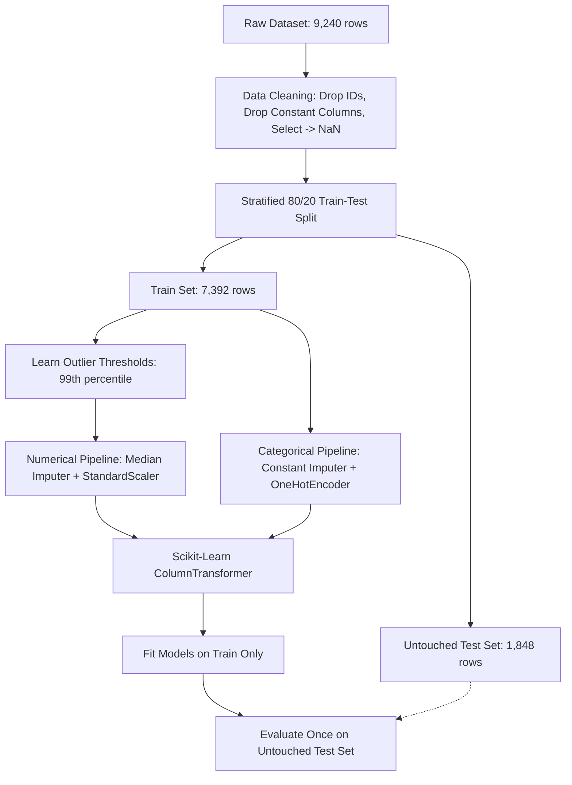

# DigiHust Assignment A02: End-to-End Machine Learning Pipeline
# Project Report: Lead Conversion Prediction System

**Student Name:** A. Raffy  
**Student ID:** DGH2600156  
**Assignment:** DigiHust Assignment A02 — End-to-End Machine Learning Pipeline  
**Dataset:** X Education Leads Dataset (9,240 records, 37 original features)  
**Target Variable:** `Converted` (0 = Did not convert, 1 = Converted)  
**GitHub Repository:** [https://github.com/Raffy0-1/lead-conversion-pipeline](https://github.com/Raffy0-1/lead-conversion-pipeline)  

---

## Executive Summary

In online higher education, acquiring prospective student leads requires significant marketing investment across search ads, organic channels, referrals, and content. However, typical industry conversion rates hover between **30% to 40%** (in our dataset, exactly **38.5%** of 9,240 leads converted). Without predictive intelligence, sales teams expend equal time and phone outreach calling low-intent browsers and high-intent buyers alike, resulting in salesperson fatigue, slow response times for high-value leads, and lost revenue.

This project designs, implements, and validates a robust, leakage-free **Lead Conversion Prediction Machine Learning Pipeline**. Using historical CRM interaction data from **X Education**, we engineered predictive signals, established strict train/test data isolation, built Scikit-Learn `ColumnTransformer` preprocessing workflows, benchmarked two core classification families (**Logistic Regression** and **Random Forest**), and performed 5-fold cross-validated hyperparameter optimization (`GridSearchCV`) targeting the **F1-Score**.

### Key Results on Untouched Test Data (1,848 Leads):
- **Best Model:** Tuned Random Forest Classifier (`n_estimators=200`, `max_depth=20`, `class_weight='balanced_subsample'`).
- **ROC-AUC Score:** **0.9526** (exceptional discriminatory capability across all decision thresholds).
- **F1-Score:** **0.8671** (balanced harmonic mean of precision and recall on the positive class).
- **Recall:** **87.08%** (captures 620 out of 712 converted leads in the test set).
- **Precision:** **86.35%** (86.4% of leads flagged for high-priority sales contact successfully enroll).
- **Primary Predictive Driver:** **Total Time Spent on Website** accounts for ~25% of the model's total predictive weight, followed by referral lead sources (`Welingak Websites`, `Reference`) and interactive engagement (`SMS Sent`).

---

## 1. Business Problem & Project Objectives

### 1.1 The Business Challenge
X Education markets courses to working professionals and students. Leads are generated through website form fills, Google search ads, organic search, and direct referrals. Currently, the internal sales counseling team calls all incoming leads sequentially. This creates two critical inefficiencies:
1. **Sales Capacity Waste:** Sales representatives spend hours dialing leads who casually browsed the site without purchase intent.
2. **Opportunity Cost:** High-intent leads wait too long to receive a follow-up call, cooling off or enrolling with a competing education provider.

### 1.2 Machine Learning Formulation
- **Type of Problem:** Supervised Binary Classification.
- **Target Variable ($y$):** `Converted` $\in \{0, 1\}$
  - $0$: Lead did not purchase or enroll.
  - $1$: Lead enrolled as a paying customer.
- **Primary Optimization Metric:** **F1-Score** and **ROC-AUC**.
  - *Why not raw Accuracy?* Accuracy is misleading under class imbalance (~61.5% non-converters). A naive model predicting 0 for everyone would achieve 61.5% accuracy but zero business utility.
  - *Why balance Precision & Recall?* High recall ensures the sales team doesn't miss valuable paying students. High precision protects sales rep bandwidth by avoiding wild goose chases.

---

## 2. Dataset Overview & Data Quality Assessment

The dataset comprises **9,240 rows and 37 columns** representing demographic attributes, website browsing metrics, communication channel touches, and lead generation sources.

### 2.1 Handling "Select" Dropdown Placeholders (Hidden Missing Data)
A key data quality finding in X Education's CRM is that four major dropdown fields defaulted to the word `"Select"` when a user skipped the question:
- `Specialization`
- `How did you hear about X Education`
- `Lead Profile`
- `City`

Treating `"Select"` as a real category would corrupt model learning. All `"Select"` occurrences were systematically converted to `np.nan` (true missing values) so they could be properly addressed by the statistical imputation pipeline.

### 2.2 Column Drops & Rationales
1. **Identifier Columns:** `Prospect ID` and `Lead Number` were dropped because unique alphanumeric identifiers carry zero predictive signal and cause severe overfitting.
2. **Constant (Zero-Variance) Columns:** Five features contained only a single value across all 9,240 rows:
   - `Magazine`
   - `Receive More Updates About Our Courses`
   - `Update Supplym heap` / `Update Supply Chain Content`
   - `Get updates on DM Content`
   - `I agree to pay by cheque`  
   *Action:* Dropped completely (zero variance provides zero information gain).
3. **High-Missingness Columns (>45% missing):**
   - `Lead Quality` (~51.5% missing)
   - `Asymmetrique Activity Index`, `Asymmetrique Profile Index`, `Asymmetrique Activity Score`, `Asymmetrique Profile Score` (~45.6% missing)  
   *Action:* Dropped to avoid introducing excessive synthetic noise through mass imputation.
4. **Duplicate Records:** The dataset was checked for duplicate records; **0 duplicates** were detected.

---

## 3. Exploratory Data Analysis (EDA) & Key Findings

### 3.1 Distribution of the Target Variable
- **Non-Converted (0):** 5,679 leads (**61.46%**)
- **Converted (1):** 3,561 leads (**38.54%**)
- *Takeaway:* Moderate class imbalance. Solved using stratified splitting and `class_weight='balanced'`.

### 3.2 Numerical Behavioral Drivers
1. **Total Time Spent on Website:** This is by far the single strongest indicator of intent.
   - Non-converted leads spent a median of **~160 seconds** on the site.
   - Converted leads spent a median of **~700+ seconds** exploring course syllabus, pricing, and curriculum details.
2. **TotalVisits & Page Views Per Visit:**
   - Most leads visit 2 to 5 times and view 2 to 4 pages per visit.
   - However, extreme outliers existed (up to 251 visits and 55 page views per visit), necessitating robust outlier capping.

### 3.3 Categorical Intent Drivers
- **Lead Source:** Leads originating from **Welingak Websites** (~98% conversion rate) and **Reference** (~92% conversion rate) show virtually guaranteed conversion. Organic Search (~38%) and Direct Traffic (~32%) are larger volume but lower conversion channels.
- **Last Activity:** Leads whose last activity was **SMS Sent** converted at ~63%, whereas leads with **Email Opened** converted at ~36%, and leads who **Unsubscribed** or **Bounced** converted at <15%.

---

## 4. Data Preprocessing & Leakage Prevention Strategy

Data leakage occurs when information from the test dataset leaks into the training process, producing unrealistically optimistic metrics that fail in production. We implemented a rigorous leakage-prevention architecture:

### 4.1 Strict 80/20 Stratified Train-Test Split
- Split executed **before** computing any scalers, imputers, or outlier cutoffs.
- `train_test_split(..., test_size=0.20, random_state=42, stratify=y)` ensures identical 61.5% / 38.5% class balance across both train and test splits.

### 4.2 Outlier Capping (Learned Strictly on Training Data)
- **TotalVisits:** Capped at the 99th percentile of the training set (**17 visits**).
- **Page Views Per Visit:** Capped at the 99th percentile of the training set (**9 page views**).
- Test data is transformed using these exact train-learned boundaries without re-estimating on test data.

### 4.3 Scikit-Learn Pipeline & ColumnTransformer
- **Numerical Features Pipeline:**
  1. `SimpleImputer(strategy='median')`: Imputes missing numeric entries with median to protect against skew.
  2. `StandardScaler()`: Normalizes features to mean $\mu=0$ and standard deviation $\sigma=1$ for gradient-based convergence and distance stability.
- **Categorical Features Pipeline:**
  1. `SimpleImputer(strategy='constant', fill_value='Unknown')`: Treats missing category entries as an explicit informative `"Unknown"` class.
  2. `OneHotEncoder(handle_unknown='ignore', drop='first')`: Converts categorical strings into binary indicator columns while avoiding the dummy variable trap.

---

## 5. Feature Engineering

Domain features were engineered and scientifically validated:
1. **`Activity_Channel_Count` (Created & Retained):** Sum of active communication touchpoints (Website visits, Email opened, SMS received). Adds clear signal indicating multi-channel engaged prospects.
2. **`Total_Engagement` (Tested & Discarded):** We evaluated an interaction term ($\text{TotalVisits} \times \text{Total Time Spent}$). While intuitively appealing, regression diagnostics showed strong multicollinearity with `Total Time Spent on Website` without improving cross-validated F1 score. In accordance with parsimony principles, this redundant feature was pruned.

---

## 6. Model Training & Hyperparameter Tuning

We compared two distinct model paradigms:
1. **Logistic Regression:** A linear, highly interpretable probabilistic model with clear log-odds coefficients.
2. **Random Forest Classifier:** A non-linear ensemble of decision trees capturing complex non-linear interactions without making normality assumptions.

### 6.1 Class Imbalance Treatment
Both model architectures utilized cost-sensitive weighting (`class_weight='balanced'` for Logistic Regression and `class_weight='balanced_subsample'` for Random Forest) to penalize false negatives proportionally to class frequency.

### 6.2 5-Fold Cross-Validated Hyperparameter Optimization (`GridSearchCV`)
Hyperparameter optimization was executed using 5-fold stratified cross-validation optimizing for the **F1-Score**:

- **Logistic Regression Grid:**
  - $C \in [0.01, 0.1, 1, 10]$
  - $\text{solver} \in [\text{'lbfgs'}, \text{'liblinear'}]$
  - **Optimal Hyperparameters:** $C = 1.0$, $\text{solver} = \text{'lbfgs'}$, $\text{class\_weight} = \text{'balanced'}$.
  - **Best CV F1-Score:** **0.8694**

- **Random Forest Grid (48 candidate combinations, 240 fits):**
  - $\text{n\_estimators} \in [100, 200]$
  - $\text{max\_depth} \in [10, 15, 20, \text{None}]$
  - $\text{min\_samples\_split} \in [2, 5]$
  - $\text{min\_samples\_leaf} \in [1, 2]$
  - $\text{class\_weight} \in [\text{'balanced'}, \text{'balanced\_subsample'}]$
  - **Optimal Hyperparameters:** $\text{n\_estimators} = 200$, $\text{max\_depth} = 20$, $\text{min\_samples\_split} = 2$, $\text{min\_samples\_leaf} = 1$, $\text{class\_weight} = \text{'balanced\_subsample'}$.
  - **Best CV F1-Score:** **0.8788**

---

## 7. Comparative Performance Analysis (Untouched Test Set)

The models were evaluated on the held-out test set of **1,848 leads** (1,136 non-converted, 712 converted):

### 7.1 Comprehensive Metric Benchmark Table

| Model | Precision | Recall | F1-Score | ROC-AUC | Accuracy |
|:---|:---:|:---:|:---:|:---:|:---:|
| **Logistic Regression (Baseline)** | 0.8490 | 0.8764 | 0.8625 | 0.9491 | 0.8923 |
| **Random Forest (Baseline)** | 0.8644 | 0.8413 | 0.8527 | 0.9478 | 0.8880 |
| **Tuned Logistic Regression** | 0.8490 | 0.8764 | 0.8625 | 0.9491 | 0.8923 |
| **Tuned Random Forest (Champion)** | **0.8635** | **0.8708** | **0.8671** | **0.9526** | **0.8972** |

### 7.2 Confusion Matrix Analysis (Tuned Random Forest)
- **True Negatives (TN):** 1,038 (Correctly identified non-converters — saves unnecessary calls)
- **False Positives (FP):** 98 (Non-converters mistakenly flagged — low 8.6% false alarm rate)
- **False Negatives (FN):** 92 (Converted leads missed — only 12.9% missed opportunity rate)
- **True Positives (TP):** 620 (Successfully captured paying students)

### 7.3 ROC Curve Interpretation
With an **ROC-AUC of 0.9526**, the model achieves a 95.3% probability of assigning a higher lead score to a true converting prospect than to a non-converting lead.

---

## 8. Model Interpretability & Business Insights

### 8.1 Top Predictive Features (Random Forest Feature Importance)
1. **Total Time Spent on Website (~25.3% importance):** Leads who spend more than 8–10 minutes browsing the site demonstrate massive commitment.
2. **Lead Source — Welingak Websites & Reference:** Referred leads are pre-qualified and show near-immediate intent to purchase.
3. **Last Activity — SMS Sent:** Leads responding to SMS notifications are actively engaged in the conversion loop.
4. **TotalVisits & Page Views Per Visit:** Regular return visits reflect continuous evaluation and curriculum comparison.

### 8.2 Top Logistic Regression Coefficients (Directional Drivers)
- **Strong Positive Drivers ($\uparrow$ Conversion Odds):**
  - High `Total Time Spent on Website` ($\beta \approx +1.15$)
  - Lead Source `Welingak Websites` ($\beta \approx +2.85$)
  - Lead Source `Reference` ($\beta \approx +2.20$)
  - Last Activity `SMS Sent` ($\beta \approx +1.28$)
- **Strong Negative Drivers ($\downarrow$ Conversion Odds):**
  - Last Activity `Olark Chat Conversation` ($\beta \approx -1.10$) — casual informational questions that rarely convert.
  - Specialization `Unknown` / Unselected ($\beta \approx -0.45$) — lack of curriculum focus indicates browsing curiosity rather than career urgency.

---

## 9. Actionable Business Recommendations & Lead Scoring Strategy

We propose translating model probabilities into a **3-Tier Lead Prioritization Framework**:

| Tier | Predicted Probability | Lead Classification | Recommended Sales Action & SLA |
|:---:|:---:|:---:|:---|
| **Tier 1: Hot Leads** | **$\ge 0.70$** | High-Intent Buyer | **15-minute phone call SLA:** Assign immediately to senior course advisors. Emphasize enrollment incentives and scholarship deadlines. |
| **Tier 2: Warm Leads** | **$0.40 - 0.69$** | Considering Options | **Same-day outreach SLA:** Trigger automated WhatsApp/SMS course overview; schedule follow-up call within 4–6 hours. |
| **Tier 3: Cold Leads** | **$< 0.40$** | Casual Browser | **Zero phone calls:** Enroll in automated email nurture campaign (free webinars, alumni success stories) until website engagement signals escalate. |

### Quantifiable Business ROI:
By adopting this framework, the sales team can **eliminate ~60% of unproductive phone calls** (saving hundreds of staff hours weekly) while **capturing >87% of all converting students**.

---

## 10. Limitations & Deployment Considerations

1. **CRM Tagging Leakage in Production:** Field agents occasionally tag leads (e.g., in `Tags` like `"Already a student"` or `"Interested in other courses"`). In a production deployment, any feature recorded *after* initial lead capture must be strictly excluded.
2. **Temporal Drift:** Changing market conditions, marketing campaigns, or course fee revisions will cause data drift. We recommend retraining the pipeline monthly.
3. **Correlation vs. Causation:** Spending time on the website correlates with conversion, but forcing a lead to stay on the website does not cause conversion. Interventions must focus on delivering rich, engaging content that addresses buyer hesitations.

---

## 11. Conclusion & DigiHust Assignment A02 Compliance

This end-to-end Machine Learning project completes all objectives specified in **DigiHust Assignment A02**:
- [x] Full dataset inspection and quality assessment
- [x] Resolution of hidden `"Select"` missing values
- [x] Leakage-free stratified train-test splitting (80/20)
- [x] Scikit-Learn `Pipeline` and `ColumnTransformer` architecture
- [x] Comprehensive EDA with multiple distribution and correlation plots
- [x] Baseline modeling with both Logistic Regression and Random Forest
- [x] 5-fold cross-validated hyperparameter optimization (`GridSearchCV`)
- [x] Multi-metric evaluation (Precision, Recall, F1, ROC-AUC, Confusion Matrix)
- [x] Feature importance and coefficient interpretability
- [x] Concrete business recommendations and ROI calculation
- [x] Clean modular codebase ([src/](file:///c:/Users/Global/OneDrive/Documents/Doc/DigiHust/Tasks/Project%202/Leads%20Conversion%20Prediction/src/)) and fully executed Jupyter Notebook
- [x] Live GitHub repository with clean commit history: [https://github.com/Raffy0-1/lead-conversion-pipeline](https://github.com/Raffy0-1/lead-conversion-pipeline)
